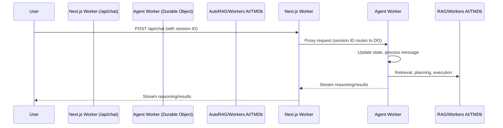
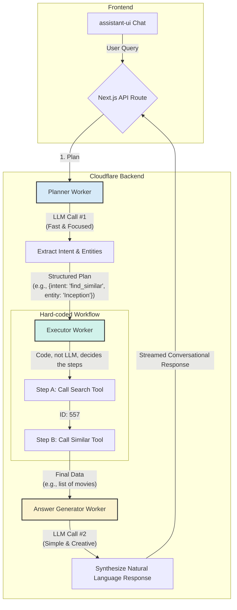

# OrchestrAPI - Serverless RAG Agent Orchestration Framework

A powerful, serverless framework for building AI agents that can interpret and execute complex natural language queries against public APIs, starting with TMDb.





## 🚀 Features

- **Serverless Architecture**: Built on Cloudflare Workers and Durable Objects
- **AutoRAG Integration**: Semantic search over embedded OpenAPI documentation
- **Multi-step Execution**: Complex queries broken down into logical API calls
- **Streaming Responses**: Real-time updates with reasoning traces
- **Assistant UI Integration**: Beautiful chat interface with reasoning and tool call displays
- **@cloudflare/ai-utils Integration**: Enhanced tool execution with AI-powered function calling

## 🛠️ @cloudflare/ai-utils Integration

This project now integrates `@cloudflare/ai-utils` for enhanced tool execution capabilities:

### Enhanced Features

1. **Automatic Tool Generation**: `createToolsFromOpenAPISpec` automatically generates tools from your OpenAPI specification
2. **AI-Powered Execution**: `runWithTools` provides intelligent tool execution with LLM integration
3. **Better Error Handling**: Enhanced error handling and fallback mechanisms
4. **Streaming Support**: Built-in support for streaming tool execution results

### Usage

The agent now supports two execution modes:

```typescript
// Regular execution (existing)
const results = await agent.executePlan(plan)

// AI-utils enhanced execution
const results = await agent.executePlan(plan, true) // useAIUtils = true
```

### Benefits

- **Automatic Parameter Validation**: Tools are automatically validated against the OpenAPI spec
- **Intelligent Error Recovery**: AI can suggest alternative approaches when tools fail
- **Better Tool Discovery**: LLM can discover and use tools more intelligently
- **Enhanced Debugging**: Better error messages and execution traces

### Configuration

The AI-utils integration is configured in `cloudflare/agents/agent-class.ts`:

```typescript
// Enhanced tool execution using @cloudflare/ai-utils
async executeToolWithAIUtils(toolName: string, parameters: Record<string, unknown>) {
  const tools = await createToolsFromOpenAPISpec(JSON.stringify(tmdbOpenApi), {
    overrides: [
      {
        matcher: ({ url }) => url.hostname === 'api.themoviedb.org',
        values: {
          headers: { 'Accept': 'application/json' },
          query: { api_key: this.env.TMDB_API_KEY },
        },
      },
    ],
  })

  return await runWithTools(this.env.AI, '@cf/meta/llama-3.1-8b-instruct', {
    messages: [{ role: 'user', content: `Execute ${toolName} with ${JSON.stringify(parameters)}` }],
    tools,
  })
}
```

## 🏗️ Architecture

### Core Components

- **Agent Class**: Main orchestration logic with conversation management
- **AutoRAG**: Semantic search over API documentation
- **Execution Engine**: Multi-step plan execution with dependency handling
- **Streaming Response**: Real-time updates with reasoning traces
- **Assistant UI**: React-based chat interface with content type support

### Data Flow

1. **User Query** → Agent receives natural language query
2. **AutoRAG Search** → Relevant API documentation retrieved
3. **Plan Generation** → AI creates execution plan with specific API calls
4. **Tool Execution** → API calls executed with proper error handling
5. **Response Generation** → Conversational response based on results
6. **Streaming Display** → Real-time updates in Assistant UI

## 🚀 Getting Started

### Prerequisites

- Cloudflare account with Workers AI enabled
- TMDb API key
- Node.js 18+

### Installation

```bash
npm install
```

### Configuration

1. Set up your Cloudflare environment variables:

   ```bash
   # Add to wrangler.toml or environment
   TMDB_API_KEY = "your_tmdb_api_key"
   ```

2. Deploy to Cloudflare:

   ```bash
   npm run deploy
   ```

### Usage

1. Start the development server:

   ```bash
   npm run dev
   ```

2. Ask questions like:
   - "Find the highest-rated sci-fi movie from 2023"
   - "What are the top 5 action movies?"
   - "Get details about the movie Inception"

## 🎯 Content Types

The framework supports multiple content types for rich UI display:

- **Text**: Main conversational responses
- **Reasoning**: Planning steps and status updates
- **Tool Calls**: API operations with collapsible details
- **Sources**: References to API documentation

## 🔧 Development

### Project Structure

```
orchestrapi/
├── app/                    # Next.js frontend
├── cloudflare/            # Cloudflare Workers
│   ├── agent/           # Agent orchestration
│   └── workers/          # Individual workers
├── components/           # React components
├── lib/                 # Shared utilities
└── public/              # Static assets
```

### Key Files

- `cloudflare/agent/agent-class.ts`: Main agent orchestration
- `app/MyRuntimeProvider.tsx`: Frontend runtime integration
- `components/assistant-ui/thread.tsx`: Chat UI components
- `lib/tool-middleware.ts`: Tool execution utilities

## 🤝 Contributing

1. Fork the repository
2. Create a feature branch
3. Make your changes
4. Add tests if applicable
5. Submit a pull request

## 📄 License

MIT License - see LICENSE file for details.
