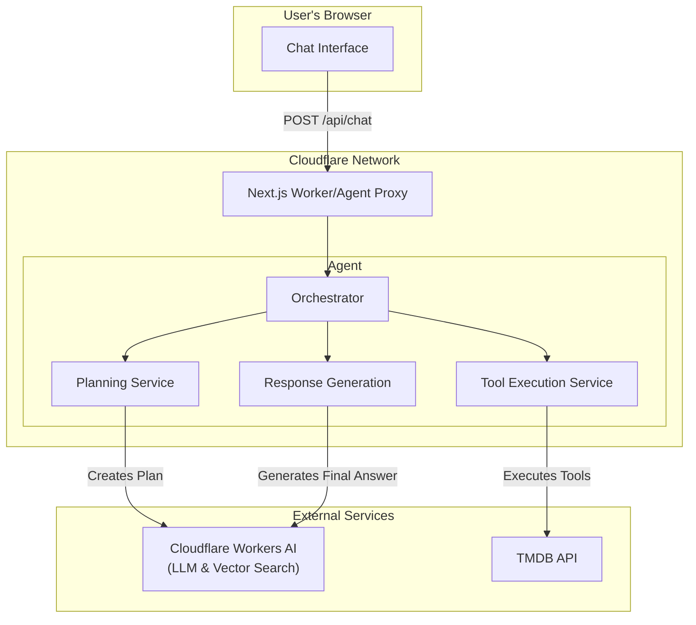
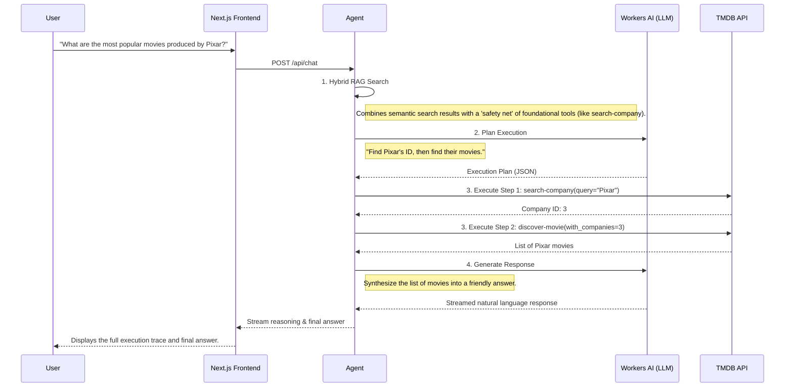

<h1 align="center">
  <br>
  <a href="https://orchestrapi.4ad2.workers.dev/"></a>
  <br>
  OrchestrAPI
  <br>
</h1>

<p align="center">
  A RAG Agent for orchestrating any API
</p>

OrchestrAPI is a RAG Agent orchestration framework that can interpret complex natural language queries and execute them against an API. Built on the Cloudflare Agents SDK and the cutting-edge stack of Cloudflare Workers, Durable Objects, and the Vercel AI SDK, this project demonstrates a robust, production-ready architecture for creating scalable and intelligent AI agents.

This repository uses the [TMDB (The Movie Database)](https://www.themoviedb.org/?language=en-US) API as a demonstration of the agent's capabilities.


https://github.com/user-attachments/assets/84ed63d8-2dbb-4660-926d-172b40f090a6


## Technologies Used

- **UI Framework**: [Next.js](https://nextjs.org/)
- **Backend**: [Cloudflare Workers](https://workers.cloudflare.com/)
- **State Management**: [Cloudflare Durable Objects](https://www.cloudflare.com/developer-platform/products/durable-objects/)
- **Vector Store**: [Cloudflare AutoRAG](https://developers.cloudflare.com/autorag/)
- **Inference Provider**: [Cloudflare Workers AI](https://www.cloudflare.com/developer-platform/products/workers-ai/)
- **Agent Framework**: [Cloudflare Agents SDK](https://agents.cloudflare.com/)

## Navigating this project

```sh
.
├── app/
│   ├── api/chat/route.ts      # Next.js API route for the chat UI
│   └── assistant.tsx          # Main frontend component for the assistant UI
├── cloudflare/
│   └── agent/
│       ├── streaming-orchestrator.ts # Coordinates the 4-step agent process
│       ├── planning-service.ts       # Creates execution plan from user query
│       ├── tool-execution-service.ts # Executes API calls based on the plan
│       └── rag-service.ts            # Finds relevant endpoints with AutoRAG
├── lib/
│   └── tmdb-open-api.json     # OpenAPI spec for the TMDB API
└── wrangler.jsonc             # Configuration for the Cloudflare Worker
```

- [**Streaming Orchestrator** (`streaming-orchestrator.ts`)](/cloudflare/agent/streaming-orchestrator.ts): The core of the agent, managing the flow from query to response.
- [**Hybrid RAG Search** (`rag-service.ts`)](/cloudflare/agent/rag-service.ts): Finds relevant API endpoints using Cloudflare AutoRAG.
- [**LLM Planning** (`planning-service.ts`)](/cloudflare/agent/planning-service.ts): Generates a multi-step execution plan using an LLM.
- [**Deterministic Tool Execution** (`tool-execution-service.ts`)](/cloudflare/agent/tool-execution-service.ts): Executes the plan by calling the correct API tools.
- [**Frontend** (`assistant.tsx`)](/app/assistant.tsx): The main React component for the chat interface.

## Architecture Diagram



## How It Works

The agent uses a 4-step process to answer user queries, coordinated by a central [`StreamingOrchestrator`](/cloudflare/agent/streaming-orchestrator.ts). This provides a transparent, real-time experience for the user.

1. **Hybrid RAG Search**: For any user query, the agent first queries **Cloudflare AutoRAG**, which performs a semantic search against the OpenAPI specification to find the most relevant API endpoints. Each endpoint in the OpenAPI spec is formatted and summarized to fit the chunk size limit in the vector database. To make the agent more robust, these results are combined with a curated "safety net" of foundational tools (e.g., `search-company`, `search-person`) that are essential for resolving entities.

2. **LLM Planning**: The combined documentation is then passed to the [`PlanningService`](/cloudflare/agent/planning-service.ts), which uses [DeepSeeks's R1 Distill Qwen 32B](https://huggingface.co/deepseek-ai/DeepSeek-R1-Distill-Qwen-32B) model to create a structured, multi-step JSON execution plan. The prompt for this stage is hardened to ensure the LLM generates valid, executable plans that can handle dependencies between steps (e.g., using the ID from step 1 as an input for step 2).

3. **Deterministic Tool Execution**: The [`ToolExecutionService`](/cloudflare/agent/tool-execution-service.ts) executes the plan. It uses functions derived from the OpenAPI spec and calls them directly with parameters from the plan. This approach is deterministic and avoids unpredictable "AI calling an AI" behavior.

4. **Response Generation**: Finally, the raw JSON results from the API calls are passed to the [`ResponseGenerationService`](/cloudflare/agent/response-generation-service.ts), which uses one last LLM call to synthesize the data into a human-readable answer.



## Architectural Considerations

- **Hybrid RAG**: Combines semantic search with a curated list of foundational tools for robust planning.
- **Multi-Step Planning**: Capable of creating and executing complex, multi-step plans to answer nuanced questions.
- **Deterministic Execution**: Uses a reliable, direct execution path for tool calls, avoiding unpredictable behavior.
- **Streaming UI**: Provides a real-time, transparent view into the agent's reasoning process, using the Vercel AI SDK's streaming utilities.
- **Serverless & Scalable**: Built entirely on Cloudflare's serverless platform (Workers, Durable Objects, AutoRAG), ensuring high scalability and cost-efficiency.

## Getting Started

### Prerequisites

- A Cloudflare account
- A TMDB API Key
- [Node.js](https://nodejs.org/) (v18 or later)

### Installation & Setup

1. **Clone the repository:**

    ```bash
    git clone https://github.com/hasibhassan/orchestrapi.git
    cd orchestrapi
    ```

2. **Install dependencies:**

    ```bash
    npm install
    ```

3. **Configure Cloudflare:**
    - Rename `wrangler.toml.example` to `wrangler.toml` and fill in your Cloudflare account details.
    - Create a D1 database and an AutoRAG index in your Cloudflare dashboard. Add the binding names and IDs to your `wrangler.toml`.
    - Create a `.dev.vars` file in the root of the project and add your TMDB API key (or set via the Console):

      ```
      TMDB_API_TOKEN="your_tmdb_api_token_here"
      ```

    >[!NOTE]
    >You will need to run a script to parse your `tmdb-open-api.json` and insert the vectors into your Cloudflare AutoRAG index. (Note: The seeding script is not included in this repository. Keep in mind the chunking limits in Vectorize.).

4. **Run the development server:**

    ```bash
    npm run dev

    # To deploy ensure you have the Cloudflare Wrangler CLI configured properly:
    npm run deploy
    # also as of now, you will have to deploy the agent-proxy-worker manually
    wrangler deploy --config wrangler.agent-worker.jsonc
    ```

This will start the Next.js frontend and the Cloudflare Worker backend simultaneously. You can ask questions like:

- "Find the highest-rated sci-fi movie from 2023"
- "What are the top 5 action movies?"
- "Get details about the movie Inception"
