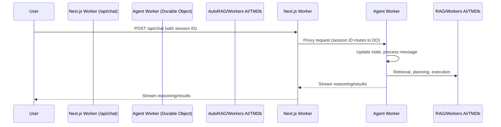

# OrchestrAPI

```mermaid
sequenceDiagram
    participant User
    participant Next.js Worker (/api/chat)
    participant Agent Worker (Durable Object)
    participant AutoRAG/Workers AI/TMDb

    User->>Next.js Worker: POST /api/chat (with session ID)
    Next.js Worker->>Agent Worker: Proxy request (session ID routes to DO)
    Agent Worker->>Agent Worker: Update state, process message
    Agent Worker->> RAG/Workers AI/TMDb: Retrieval, planning, execution
    Agent Worker-->>Next.js Worker: Stream reasoning/results
    Next.js Worker-->>User: Stream reasoning/results
```
